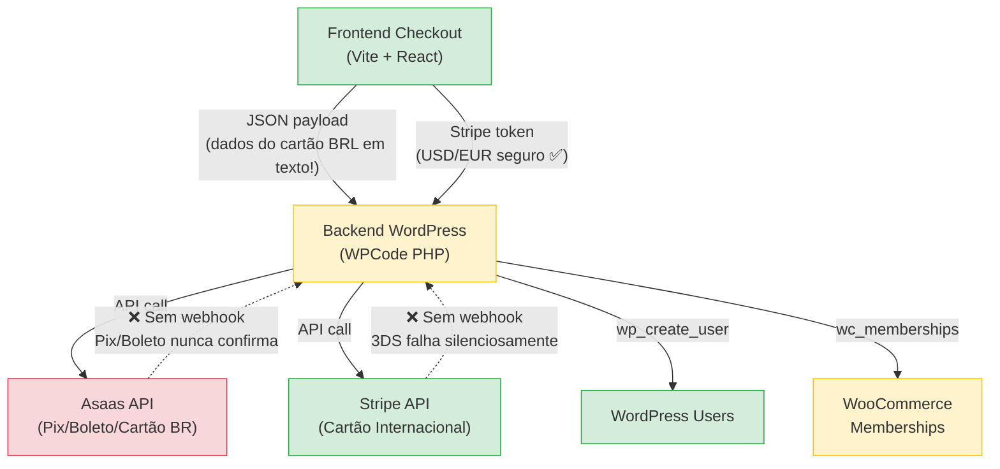

# 🔍 Relatório de Auditoria — Sistema de Checkout Reiki Time Academy

**Data:** 16 de Junho de 2026  
**Escopo:** Frontend Checkout (Vite + React), Landing Page, Backend WordPress (WPCode PHP)  
**Tipo:** Auditoria de Segurança e Estabilidade — **SOMENTE LEITURA**

---

## Arquivos Analisados

| Componente | Arquivo Principal | Caminho |
|---|---|---|
| Frontend Checkout | [App.tsx](file:///Users/romor/antigravity/reiki-checkout/src/App.tsx) | `reiki-checkout/src/App.tsx` |
| Landing Page | [CheckoutModal.tsx](file:///Users/romor/antigravity/Reiki-Time-Academy/src/components/CheckoutModal.tsx) | `Reiki-Time-Academy/src/components/CheckoutModal.tsx` |
| Backend WordPress | [backend-wpcode.php](file:///Users/romor/antigravity/reiki-checkout/backend-wpcode.php) | `reiki-checkout/backend-wpcode.php` |
| Config Links | [LinkConfigurer.tsx](file:///Users/romor/antigravity/Reiki-Time-Academy/src/components/LinkConfigurer.tsx) | `Reiki-Time-Academy/src/components/LinkConfigurer.tsx` |

---

## 🟢 Pontos Fortes (O que está bem feito e seguro)

### 1. Chaves de API Separadas Corretamente (Frontend vs Backend)

As **chaves secretas** (`sk_live_...` do Stripe e `$aact_...` do Asaas) existem **somente** no backend PHP ([backend-wpcode.php:7-9](file:///Users/romor/antigravity/reiki-checkout/backend-wpcode.php#L7-L9)). No frontend ([App.tsx:7](file:///Users/romor/antigravity/reiki-checkout/src/App.tsx#L7)), somente a **chave pública** (`pk_live_...`) do Stripe é utilizada — o que é o padrão correto e esperado pelo Stripe.

> [!TIP]
> Busca automatizada (`grep -rI "sk_live\|sk_test\|ASAAS_API\|secret"`) nos diretórios `src/` de ambos os projetos retornou **zero resultados**. Nenhuma chave secreta vaza para o navegador do cliente.

### 2. Uso Correto do Stripe Elements (Tokenização PCI-Compliant)

Para pagamentos internacionais (USD/EUR), o checkout usa `CardElement` do Stripe Elements ([App.tsx:449-451](file:///Users/romor/antigravity/reiki-checkout/src/App.tsx#L449-L451)). Isso significa que os dados de cartão internacional **nunca tocam o servidor do WordPress** — são tokenizados diretamente no iframe seguro do Stripe. O `paymentMethod.id` é enviado ao backend, não o número do cartão.

### 3. Validação de CPF no Frontend

A função [isValidCPF](file:///Users/romor/antigravity/reiki-checkout/src/App.tsx#L32-L46) implementa a validação algorítmica completa (ambos dígitos verificadores), impedindo que CPFs inválidos ou sequenciais como `111.111.111-11` passem. Boa prática.

### 4. Validação de Cartão via Algoritmo de Luhn

A função [isValidLuhn](file:///Users/romor/antigravity/reiki-checkout/src/App.tsx#L48-L63) impede envio de números de cartão inválidos ao backend, reduzindo chamadas desnecessárias à API da Asaas.

### 5. Tratamento de Erro no `fetch` do Checkout

O bloco `try/catch/finally` em [handleCheckout](file:///Users/romor/antigravity/reiki-checkout/src/App.tsx#L209-L230) captura erros de rede com mensagem genérica amigável e **sempre** desativa o `isLoading` no `finally`, impedindo que o botão fique travado em "Processando…" eternamente.

### 6. Landing Page com Fallback Silencioso para Lead Tracking

O [CheckoutModal.tsx:42-63](file:///Users/romor/antigravity/Reiki-Time-Academy/src/components/CheckoutModal.tsx#L42-L63) usa `AbortController` com timeout de 1500ms e `catch` silencioso. Se a API de leads falhar, o usuário é redirecionado normalmente ao checkout. Excelente priorização da experiência do cliente.

### 7. Proteção contra Dupla Matrícula

A função [conceder_acesso_curso](file:///Users/romor/antigravity/reiki-checkout/backend-wpcode.php#L216-L229) verifica se o usuário **já é membro ativo** antes de criar uma nova membership (`wc_memberships_is_user_active_member`). Evita duplicatas.

### 8. Buscar ou Criar Cliente no Asaas

A função [buscar_ou_criar_cliente_asaas](file:///Users/romor/antigravity/reiki-checkout/backend-wpcode.php#L134-L156) tenta buscar o cliente existente por CPF antes de criar um novo. Evita duplicação de clientes no painel Asaas.

---

## 🟡 Avisos (Melhorias de Estabilidade e Boas Práticas)

### 1. ⚠️ Dados de Cartão BRL Transitam em Texto Puro (Asaas)

> [!IMPORTANT]
> Para pagamentos com cartão em BRL (Asaas), os dados completos do cartão (número, CVV, validade, nome) são coletados em `<input>` comuns no React e enviados em JSON puro via `fetch` para o WordPress ([App.tsx:199-206](file:///Users/romor/antigravity/reiki-checkout/src/App.tsx#L199-L206)):
>
> ```javascript
> payload.cc_number = ccNumber;
> payload.cc_cvv = ccCvv;
> ```
>
> Esses dados passam pelo servidor WordPress antes de chegar na API da Asaas ([backend-wpcode.php:93-98](file:///Users/romor/antigravity/reiki-checkout/backend-wpcode.php#L93-L98)).

**Risco:** O servidor WordPress vê e processa os dados PAN (número do cartão, CVV). Isso coloca o sistema fora da conformidade PCI-DSS SAQ A e exige SAQ D (o nível mais rigoroso).

**Recomendação:** Migrar para a **tokenização via JS da Asaas** (Asaas.js / Asaas Checkout), similar ao que já é feito com o Stripe Elements. Assim, o cartão é tokenizado no navegador e apenas o token é enviado ao backend.

### 2. ⚠️ Mapeamento de Campo Inconsistente (Frontend → Backend)

O frontend envia:
```json
{ "produto": "cuidar", "gateway": "asaas", "metodo": "credit_card" }
```

Mas o backend PHP espera campos diferentes:
```php
$metodo = $params['metodo'];           // OK ✅
$dados['produto_id']                    // ❌ Frontend envia "produto", não "produto_id"
$dados['billingType']                   // ❌ Frontend envia "metodo", não "billingType"
$dados['value']                         // ❌ Frontend envia "valorTotal", não "value"
$dados['creditCard']['number']          // ❌ Frontend envia "cc_number" plano, não aninhado
$dados['postalCode']                    // ❌ Frontend envia "cep"
```

**Risco:** Se estes campos não forem remapeados em algum middleware não-visível, o processamento **quebraria** silenciosamente no Asaas, resultando em cobrança falhada ou erros genéricos. O PHP pode estar lendo `$dados['produto_id']` como `null` e saltando a criação da membership.

**Recomendação:** Unificar os nomes de campo entre frontend e backend, ou criar uma camada de transformação explícita no PHP. Testar manualmente o fluxo completo de cartão BRL.

### 3. ⚠️ Preço Enviado pelo Frontend (Confiança no Cliente)

O valor total é calculado no frontend e enviado ao backend:
```javascript
payload.valorTotal = total;  // App.tsx:170
```

O backend utiliza `$dados['value']` diretamente para criar a cobrança no Asaas ([backend-wpcode.php:86](file:///Users/romor/antigravity/reiki-checkout/backend-wpcode.php#L86)). **Não há nenhuma validação server-side** que confirme que o preço corresponde ao produto real.

**Risco:** Um atacante pode alterar o payload no DevTools e enviar `valorTotal: 0.01`, pagando 1 centavo e recebendo acesso completo ao curso.

**Recomendação:** O backend PHP **deve** buscar o preço do produto de uma fonte confiável (array `get_reiki_products()` ou banco de dados), ignorando completamente o valor enviado pelo frontend.

### 4. ⚠️ `produto_id` Não Validado contra Lista Permitida

```php
$payload_cobranca['description'] = 'Pagamento - ' . $dados['produto_id'];  // L88
conceder_acesso_curso($user_id, $params['produto_id']);                      // L49/63
```

O `produto_id` vem do frontend sem sanitização. Embora a função `conceder_acesso_curso` faça `isset($produtos[$produto_id])` ([L218](file:///Users/romor/antigravity/reiki-checkout/backend-wpcode.php#L218)), o valor cru é usado na `description` da cobrança, o que pode gerar strings estranhas no painel Asaas se manipulado.

### 5. ⚠️ Nenhuma Validação de Input no Backend PHP

Não há uso de `sanitize_text_field()`, `sanitize_email()`, `is_email()`, `absint()`, ou qualquer função de sanitização do WordPress em nenhum campo recebido. Campos como `$dados['nome']`, `$dados['email']`, e `$dados['phone']` são passados diretamente para APIs externas e para `wp_create_user()`.

**Risco:** Vulnerabilidade a **injection** (menos provável, pois o WordPress sanitiza internamente no `wp_create_user`), mas principalmente a **dados corrompidos** nos registros de clientes.

**Recomendação:** Sanitizar todos os inputs com as funções nativas do WordPress antes de processá-los.

### 6. ⚠️ Stripe: Sem Tratamento de `requires_action` (3D Secure / SCA)

```php
if ($body['status'] !== 'succeeded') {
    return array('error' => 'Pagamento recusado ou necessita autenticação.');
}
```
([backend-wpcode.php:192-194](file:///Users/romor/antigravity/reiki-checkout/backend-wpcode.php#L192-L194))

Se o banco exigir autenticação 3D Secure (SCA), o status retorna `requires_action` em vez de `succeeded`. O código atual trata isso como erro genérico, perdendo o pagamento.

**Risco:** Clientes internacionais (especialmente da UE, onde SCA é obrigatório) terão **100% de falha nos pagamentos** com cartões que exigem 3DS.

**Recomendação:** Implementar o fluxo de `handleNextAction` do Stripe no frontend para lidar com `requires_action`.

### 7. ⚠️ Sem Rate Limiting no Endpoint REST

O endpoint `reiki/v1/checkout` ([backend-wpcode.php:24-28](file:///Users/romor/antigravity/reiki-checkout/backend-wpcode.php#L24-L28)) usa `'permission_callback' => '__return_true'`, o que significa acesso público irrestrito. Não há rate limiting, CAPTCHA, ou throttling.

**Risco:** Um bot pode enviar milhares de requests por segundo, potencialmente:
- Gerando cobranças fraudulentas em massa na Asaas
- Criando centenas de usuários falsos no WordPress
- Causando custos inesperados nas APIs de pagamento

**Recomendação:** Adicionar rate limiting via plugin (como WP Rate Limiter) ou middleware WordPress, e considerar CAPTCHA invisível (reCAPTCHA v3/Turnstile) no frontend.

### 8. ⚠️ Dados Pessoais na URL (Landing Page → Checkout)

```javascript
const newCheckoutUrl = `https://checkout.reikitimeacademy.com.br/?name=...&email=...&phone=...`;
window.location.href = newCheckoutUrl;
```
([CheckoutModal.tsx:66-67](file:///Users/romor/antigravity/Reiki-Time-Academy/src/components/CheckoutModal.tsx#L66-L67))

Nome, email e telefone são passados via **query string na URL**. Esses dados ficam visíveis em:
- Histórico do navegador
- Logs de acesso do servidor web (Nginx/Apache/Cloudflare)
- Google Analytics/ferramentas de rastreamento
- Cabeçalho `Referer` se o checkout redirecionar para terceiros

**Recomendação:** Considerar `POST` redirect via formulário oculto, `sessionStorage`, ou criptografia efêmera dos parâmetros.

### 9. ⚠️ Asaas em Modo Sandbox

```php
$ASAAS_IS_SANDBOX = true;  // backend-wpcode.php:8
```

O flag de sandbox está **ativo**. Nenhum pagamento real será processado pela Asaas enquanto isso não for mudado para `false`.

> [!NOTE]
> Isso pode ser intencional (ambiente de desenvolvimento), mas vale documentar como checklist de deploy: alterar para `false` antes de ir para produção.

### 10. ⚠️ GEMINI_API_KEY no Arquivo `.env` Commitado

O arquivo [.env](file:///Users/romor/antigravity/Reiki-Time-Academy/.env) da Landing Page contém uma `GEMINI_API_KEY` real e está no repositório. Embora o `.gitignore` inclua `.env`, o arquivo pode já ter sido commitado anteriormente.

**Recomendação:** Verificar o histórico Git e rotacionar a chave se necessário.

---

## 🔴 Riscos Críticos (Atenção Imediata Necessária)

### 🔴 CRÍTICO 1: Endpoint de Checkout SEM Autenticação = Fraude Livre

> [!CAUTION]
> O endpoint `POST /wp-json/reiki/v1/checkout` é **totalmente público** (`'permission_callback' => '__return_true'`) e **não valida nenhum token, assinatura, HMAC, IP, referer, ou qualquer forma de autenticação**.

Qualquer pessoa com `curl` pode executar:

```bash
curl -X POST https://ead.reikitimeacademy.com.br/wp-json/reiki/v1/checkout \
  -H "Content-Type: application/json" \
  -d '{"metodo":"stripe","email":"hacker@evil.com","nome":"Hacker Test","produto_id":"cuidar","value":0.01,"currency":"usd","payment_method_id":"pm_card_visa"}'
```

**Consequências diretas:**
1. Se o atacante tiver um `payment_method_id` válido (criado via Stripe.js próprio), o backend cobrará R$ 0,01 e **concederá acesso completo ao curso** (linhas [62-63](file:///Users/romor/antigravity/reiki-checkout/backend-wpcode.php#L62-L63))
2. O atacante pode criar usuários arbitrários no WordPress com qualquer email
3. Pode ser usado para **enumerar emails** existentes (comportamento diferente para email existente vs novo)

**Correção necessária:**
- Validar o preço no servidor contra o catálogo de produtos
- Adicionar um token CSRF ou nonce temporário gerado pelo frontend
- Verificar o `Referer` / `Origin` como camada adicional
- Considerar um webhook do Stripe (onde o Stripe confirma o pagamento) em vez de confiar no payload do frontend

---

### 🔴 CRÍTICO 2: Edge Case Financeiro — Dinheiro Cobrado, Aluno NÃO Criado

> [!CAUTION]
> Existem **múltiplos cenários** onde o pagamento pode ser cobrado com sucesso, mas o aluno NÃO recebe acesso ao curso.

**Cenário A — Asaas Pix/Boleto (Pagamento Assíncrono)**

Quando o pagamento é PIX ou Boleto, a Asaas retorna status `PENDING`. O código em [L47](file:///Users/romor/antigravity/reiki-checkout/backend-wpcode.php#L47) só cria o usuário se status for `CONFIRMED` ou `RECEIVED`:

```php
if ($resultado['status'] == 'CONFIRMED' || $resultado['status'] == 'RECEIVED') {
    criar_usuario_silencioso(...);
    conceder_acesso_curso(...);
}
```

**Não existe nenhum webhook da Asaas configurado** para processar quando o PIX/Boleto for efetivamente pago. O cliente paga → o dinheiro entra na Asaas → mas ninguém cria o usuário no WordPress.

> **Resultado:** 💸 Cliente paga via Pix/Boleto → ❌ Nunca recebe acesso ao curso.

**Cenário B — WooCommerce Memberships Desativado**

```php
if ( function_exists('wc_memberships_create_user_membership') && isset($produtos[$produto_id]) ) {
```

Se o plugin WooCommerce Memberships for desativado (atualização, conflito, etc.), a função `wc_memberships_create_user_membership` não existirá, e a condicional falhará **silenciosamente**. O pagamento terá sido processado, o usuário criado, mas **sem acesso ao curso**. Sem log, sem alerta.

**Cenário C — Stripe Cobra e PHP Falha na Sequência**

```php
// Stripe aprovou na hora
$user_id = criar_usuario_silencioso($params['email'], $params['nome']);
conceder_acesso_curso($user_id, $params['produto_id']);
```
([backend-wpcode.php:61-63](file:///Users/romor/antigravity/reiki-checkout/backend-wpcode.php#L61-L63))

Se `criar_usuario_silencioso` retornar um `WP_Error` (e.g., email malformado, banco de dados WordPress fora), o código segue e passa o `WP_Error` object para `conceder_acesso_curso`, que falha silenciosamente no `isset`. O Stripe já cobrou, mas o aluno não foi criado.

**Correção necessária:**
- Implementar **webhooks da Asaas** para PIX/Boleto (evento `PAYMENT_RECEIVED`)
- Implementar **webhook do Stripe** (`payment_intent.succeeded`) como fonte primária de criação de membership
- Adicionar verificação do retorno de `criar_usuario_silencioso` (checar se é `WP_Error`)
- Adicionar logging (`error_log`) em cada ponto de falha
- Considerar uma tabela de "pagamentos pendentes" como fallback

---

### 🔴 CRÍTICO 3: Mapeamento de Campos Quebrado Pode Estar Causando Falhas Silenciosas

> [!WARNING]
> A discrepância de nomes de campo entre frontend e backend (detalhada no Aviso #2) é potencialmente **destrutiva em produção agora mesmo**.

O frontend envia `"metodo": "credit_card"`, mas o backend Asaas espera `billingType` como `"CREDIT_CARD"` (maiúsculas, formato Asaas API):

```php
'billingType' => $dados['billingType'],  // Vem undefined do frontend
```

Se `$dados['billingType']` é `null`, a API da Asaas rejeitará a cobrança. Dependendo de como o erro é retornado ao frontend, o cliente pode ver um erro genérico sem entender o que aconteceu.

**Ação necessária:** Testar manualmente o fluxo completo de cartão BRL com DevTools Network aberto para confirmar se há um middleware remapeando os campos, ou se este fluxo está de fato quebrado.

---

## Resumo Executivo



| Categoria | Quantidade | Severidade |
|---|---|---|
| 🟢 Pontos Fortes | 8 | — |
| 🟡 Avisos | 10 | Média |
| 🔴 Riscos Críticos | 3 | Alta / Bloqueante |

### Prioridades Imediatas (Top 3)

1. **Implementar webhooks Asaas + Stripe** — Sem eles, pagamentos assíncronos (Pix/Boleto) e 3DS (EU cards) resultam em perda de receita e clientes sem acesso.
2. **Validar preço no servidor** — O valor do produto DEVE vir do backend, nunca do frontend. Um atacante pode pagar R$ 0,01 e ganhar acesso completo.
3. **Adicionar autenticação mínima ao endpoint** — Nonce, CSRF token, rate limiting. O endpoint atual aceita qualquer requisição da internet.

---

> [!NOTE]
> **Nenhum arquivo foi alterado.** Este relatório é exclusivamente de análise e leitura. As decisões de implementação ficam a cargo da equipe humana.
