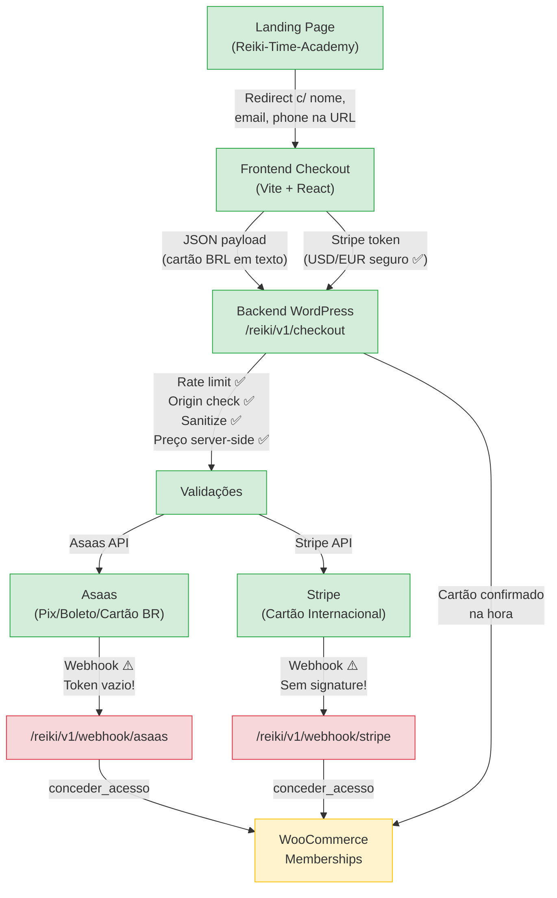

# 🔍 Relatório de Auditoria V2 — Sistema de Checkout Reiki Time Academy

**Data:** 17 de Junho de 2026  
**Escopo:** Frontend Checkout (Vite + React), Landing Page, Backend WordPress (WPCode PHP **v2**)  
**Tipo:** Auditoria de Segurança e Estabilidade — **SOMENTE LEITURA**  
**Comparação:** vs. Auditoria V1 (16 Jun 2026)

---

## 📊 Evolução Desde a Última Auditoria

O backend PHP ([backend-wpcode.php](file:///Users/romor/antigravity/reiki-checkout/backend-wpcode.php)) foi **significativamente reescrito** (230 → 327 linhas, 9.3KB → 14.4KB). Várias correções da auditoria V1 foram implementadas. O frontend ([App.tsx](file:///Users/romor/antigravity/reiki-checkout/src/App.tsx)) e a Landing Page ([CheckoutModal.tsx](file:///Users/romor/antigravity/Reiki-Time-Academy/src/components/CheckoutModal.tsx)) permanecem **inalterados**.

### Scorecard Comparativo V1 → V2

| Risco Identificado na V1 | Status V2 | Detalhes |
|---|---|---|
| 🔴 Endpoint sem autenticação | 🟡 Parcial | Origin check + Rate limiting adicionados, mas sem nonce/CSRF |
| 🔴 Preço vindo do frontend | ✅ Corrigido | Preço agora vem do catálogo server-side ([L76-89](file:///Users/romor/antigravity/reiki-checkout/backend-wpcode.php#L76-L89)) |
| 🔴 Sem webhooks Asaas/Stripe | ✅ Corrigido | Webhooks criados ([L237-279](file:///Users/romor/antigravity/reiki-checkout/backend-wpcode.php#L237-L279)) |
| 🔴 Mapeamento campos quebrado | ✅ Corrigido | Backend agora lê os campos corretos do frontend |
| 🟡 Sem sanitização de inputs | ✅ Corrigido | `sanitize_text_field`, `sanitize_email`, `intval` em uso |
| 🟡 Sem rate limiting | ✅ Corrigido | Rate limiting por IP via transient ([L96-100](file:///Users/romor/antigravity/reiki-checkout/backend-wpcode.php#L96-L100)) |
| 🟡 Sem validação WP_Error | ✅ Corrigido | Verificação de `is_wp_error` em `criar_usuario_silencioso` ([L107-109](file:///Users/romor/antigravity/reiki-checkout/backend-wpcode.php#L107-L109)) |
| 🟡 Stripe sem 3DS/SCA | 🟡 Parcial | Rejeita `requires_action` em vez de ignorar, mas não trata SCA |
| 🟡 Chaves hardcoded no PHP | ✅ Corrigido | Chaves removidas, usa `define()` com strings vazias |
| 🟡 Sandbox ativo | ✅ Corrigido | `ASAAS_IS_SANDBOX = false` ([L11](file:///Users/romor/antigravity/reiki-checkout/backend-wpcode.php#L11)) |
| 🟡 Dados cartão BRL em texto | ⬜ Não alterado | Ainda transita em JSON puro pelo servidor |
| 🟡 Dados pessoais na URL | ⬜ Não alterado | Landing Page inalterada |
| 🟡 GEMINI_API_KEY no .env | ⬜ Não alterado | Ainda presente |

---

## 🟢 Pontos Fortes (Existentes + Novos nesta versão)

### ✅ 1. Preço 100% Server-Side (NOVO)

```php
// SEGURANÇA: Preço vem do catálogo do servidor, nunca do frontend
$produto_info = isset($produtos[$produto_id]) ? $produtos[$produto_id] : null;
$valor_total = $produto_info['preco_brl'];  // L85
```
([backend-wpcode.php:76-89](file:///Users/romor/antigravity/reiki-checkout/backend-wpcode.php#L76-L89))

O catálogo de produtos agora inclui preços em BRL, USD e EUR diretamente no servidor. O `valorTotal` enviado pelo frontend é **completamente ignorado**. Um atacante não pode mais forjar o valor da compra. Excelente correção.

### ✅ 2. Webhooks Asaas e Stripe Implementados (NOVO)

Dois novos endpoints foram criados:

- **Asaas:** `POST /reiki/v1/webhook/asaas` ([L237-260](file:///Users/romor/antigravity/reiki-checkout/backend-wpcode.php#L237-L260)) — Processa eventos `PAYMENT_RECEIVED` e `PAYMENT_CONFIRMED`, extraindo `wp_user_id` e `produto_id` do `externalReference`.
- **Stripe:** `POST /reiki/v1/webhook/stripe` ([L266-279](file:///Users/romor/antigravity/reiki-checkout/backend-wpcode.php#L266-L279)) — Processa evento `payment_intent.succeeded` usando metadados do PaymentIntent.

Isso resolve o problema crítico V1 onde pagamentos Pix/Boleto nunca concediam acesso.

### ✅ 3. `externalReference` com User ID (NOVO)

```php
'externalReference' => $wp_user_id . '|' . $produto_id  // L134
```

O webhook consegue vincular o pagamento ao usuário WordPress de forma confiável. Padrão correto.

### ✅ 4. Rate Limiting por IP (NOVO)

```php
$transient_name = 'rate_limit_' . md5($ip_cliente);
$tentativas = get_transient( $transient_name ) ?: 0;
if ( $tentativas > 5 ) return new WP_Error( 'rate_limit', 'Muitas tentativas.', array( 'status' => 429 ) );
set_transient( $transient_name, $tentativas + 1, 60 * 15 );
```
([backend-wpcode.php:96-100](file:///Users/romor/antigravity/reiki-checkout/backend-wpcode.php#L96-L100))

Máximo de 5 tentativas por IP a cada 15 minutos. Boa proteção contra brute force e abusos.

### ✅ 5. Sanitização Completa de Inputs (NOVO)

Agora todos os campos são sanitizados:
- `sanitize_text_field()` para nome, CPF, telefone, métodos, cc_name, cc_cvv, cep, número ([L72-75, L115-118, L141-154](file:///Users/romor/antigravity/reiki-checkout/backend-wpcode.php#L72-L75))
- `sanitize_email()` para email ([L74](file:///Users/romor/antigravity/reiki-checkout/backend-wpcode.php#L74))
- `intval()` para parcelas ([L118](file:///Users/romor/antigravity/reiki-checkout/backend-wpcode.php#L118))
- `preg_replace('/[^0-9]/', '')` para cc_number e CPF ([L145, L151](file:///Users/romor/antigravity/reiki-checkout/backend-wpcode.php#L145))

### ✅ 6. CORS com Origin Allowlist (NOVO)

```php
$allowed_origins = array(
    'https://checkout.reikitimeacademy.com.br',
    'https://reiki-checkout.pages.dev'
);
$origin = isset($_SERVER['HTTP_ORIGIN']) ? $_SERVER['HTTP_ORIGIN'] : '';
if (in_array($origin, $allowed_origins)) {
    header("Access-Control-Allow-Origin: " . $origin);
}
```
([backend-wpcode.php:54-61](file:///Users/romor/antigravity/reiki-checkout/backend-wpcode.php#L54-L61))

Apenas os dois domínios legítimos recebem headers CORS. Boa restrição.

### ✅ 7. Verificação de `is_wp_error` no Fluxo (NOVO)

```php
$wp_user_id = criar_usuario_silencioso( $nome, $email );
if ( is_wp_error( $wp_user_id ) ) {
    return new WP_Error( 'erro_usuario', 'Não foi possível criar a conta do aluno.', array( 'status' => 500 ) );
}
```
([backend-wpcode.php:106-109](file:///Users/romor/antigravity/reiki-checkout/backend-wpcode.php#L106-L109))

O fluxo agora para corretamente se o usuário não puder ser criado, evitando o edge case V1 onde o pagamento era processado mas o usuário ficava sem acesso.

### 🟢 8. Chaves Secretas Isoladas do Frontend (Mantido)

Nenhuma chave secreta encontrada no frontend (`grep` retornou zero resultados). Somente a chave pública do Stripe `pk_live_...` está em [App.tsx:7](file:///Users/romor/antigravity/reiki-checkout/src/App.tsx#L7).

### 🟢 9. Stripe Elements para Cartão Internacional (Mantido)

Tokenização PCI-compliant via `CardElement` do Stripe em [App.tsx:449-451](file:///Users/romor/antigravity/reiki-checkout/src/App.tsx#L449-L451). Dados de cartão internacional nunca tocam o servidor WordPress.

### 🟢 10. Validação CPF + Luhn no Frontend (Mantido)

Funções [isValidCPF](file:///Users/romor/antigravity/reiki-checkout/src/App.tsx#L32-L46) e [isValidLuhn](file:///Users/romor/antigravity/reiki-checkout/src/App.tsx#L48-L63) continuam sólidas.

### 🟢 11. Proteção Contra Dupla Matrícula (Mantido)

[conceder_acesso_curso](file:///Users/romor/antigravity/reiki-checkout/backend-wpcode.php#L285-L297) continua verificando `wc_memberships_is_user_active_member` antes de criar membership.

### 🟢 12. Landing Page com Fallback Silencioso (Mantido)

[CheckoutModal.tsx:42-63](file:///Users/romor/antigravity/Reiki-Time-Academy/src/components/CheckoutModal.tsx#L42-L63) — AbortController com timeout de 1500ms para lead tracking. Não bloqueia redirecionamento se a API de leads falhar.

---

## 🟡 Avisos (Melhorias Recomendadas)

### 🟡 1. Webhook do Stripe NÃO Valida Assinatura (Stripe Signing Secret)

> [!IMPORTANT]
> O webhook do Stripe em [L266-279](file:///Users/romor/antigravity/reiki-checkout/backend-wpcode.php#L266-L279) aceita qualquer JSON que chegue no endpoint e o processa sem verificar a assinatura `Stripe-Signature`.

```php
function processar_webhook_stripe( WP_REST_Request $request ) {
    $payload = $request->get_json_params();
    // ❌ Não verifica Stripe-Signature header
    if ( isset($payload['type']) && $payload['type'] === 'payment_intent.succeeded' ) {
        // Concede acesso diretamente...
    }
}
```

**Risco:** Um atacante pode enviar um POST forjado para `/wp-json/reiki/v1/webhook/stripe` com:
```json
{
  "type": "payment_intent.succeeded",
  "data": { "object": { "metadata": { "wp_user_id": "1", "produto_id": "cuidar" } } }
}
```
...e conceder acesso a qualquer usuário WordPress sem pagar.

**Correção necessária:** Implementar verificação com `Stripe Webhook Signing Secret`:
```php
$sig_header = $_SERVER['HTTP_STRIPE_SIGNATURE'] ?? '';
$endpoint_secret = 'whsec_...';
$payload_raw = file_get_contents('php://input');
try {
    \Stripe\Webhook::constructEvent($payload_raw, $sig_header, $endpoint_secret);
} catch (\Exception $e) {
    return new WP_Error('invalid_sig', 'Assinatura inválida', array('status' => 401));
}
```

### 🟡 2. Webhook do Asaas: Token Condicional Pode Ficar Desligado

```php
if ( defined('REIKI_ASAAS_WEBHOOK_TOKEN') && REIKI_ASAAS_WEBHOOK_TOKEN !== '' ) {
    // Só valida se o token estiver preenchido
}
```
([backend-wpcode.php:238-243](file:///Users/romor/antigravity/reiki-checkout/backend-wpcode.php#L238-L243))

A constante está definida como string vazia:
```php
define('REIKI_ASAAS_WEBHOOK_TOKEN', '');  // Token removido  (L10)
```

**Risco:** Com o token vazio, a verificação é **silenciosamente ignorada** (`''` é falsy), deixando o webhook Asaas tão vulnerável quanto o do Stripe. Um atacante pode forjar eventos `PAYMENT_CONFIRMED`.

**Correção:** Preencher `REIKI_ASAAS_WEBHOOK_TOKEN` com o token real configurado no painel Asaas, ou **inverter a lógica** para rejeitar por padrão quando o token não está configurado.

### 🟡 3. Dados de Cartão BRL Ainda Transitam em Texto Puro (Remanescente)

Os dados completos do cartão (número, CVV, validade) continuam sendo enviados em JSON puro do frontend ([App.tsx:199-206](file:///Users/romor/antigravity/reiki-checkout/src/App.tsx#L199-L206)) para o WordPress ([backend-wpcode.php:143-148](file:///Users/romor/antigravity/reiki-checkout/backend-wpcode.php#L143-L148)), que então repassa à API da Asaas.

**Impacto PCI:** O servidor WordPress se torna um "pass-through" de dados PAN. Exige conformidade PCI-DSS SAQ D.

**Recomendação:** Migrar para o **SDK JavaScript da Asaas** (similar ao Stripe Elements) para tokenizar o cartão no navegador. A Asaas oferece isso via `asaas.js`.

### 🟡 4. Stripe: 3D Secure / SCA Ainda Não Tratado

```php
if ( $body_resp['status'] === 'succeeded' || $body_resp['status'] === 'requires_capture' ) {
    // OK
} else {
    return new WP_Error( 'pendente', 'Pagamento requer ação adicional ou falhou.', array( 'status' => 400 ) );
}
```
([backend-wpcode.php:219-225](file:///Users/romor/antigravity/reiki-checkout/backend-wpcode.php#L219-L225))

Melhoria sobre V1 (agora retorna erro claro em vez de silencioso), mas ainda **rejeita** pagamentos que requerem 3D Secure. Na UE, a maioria dos cartões exigirá SCA.

**Impacto:** Clientes internacionais na UE terão alta taxa de rejeição.

**Recomendação:** Implementar `stripe.handleNextAction()` no frontend quando o backend retornar status `requires_action`, seguido de confirmação via webhook.

### 🟡 5. Endpoint de Checkout: Origin Check Não Substitui Autenticação

> [!NOTE]
> O CORS `allowed_origins` check ([L54-61](file:///Users/romor/antigravity/reiki-checkout/backend-wpcode.php#L54-L61)) é uma boa camada, mas **não é uma medida de segurança**. CORS é enforced pelo **navegador**, não pelo servidor. Um `curl` ou Postman ignora completamente CORS.

O endpoint continua usando `'permission_callback' => '__return_true'` ([L36](file:///Users/romor/antigravity/reiki-checkout/backend-wpcode.php#L36)), aberto a qualquer requisição HTTP.

**Mitigantes atuais:** O rate limiting (5/15min) dificulta abuso em massa, e o preço server-side impede manipulação de valor. O risco foi **reduzido**, mas não eliminado.

**Recomendação futura:** Adicionar um nonce/token CSRF gerado pelo frontend no momento do carregamento da página, validado no backend.

### 🟡 6. Dados Pessoais na URL da Landing Page (Remanescente)

```javascript
const newCheckoutUrl = `https://checkout.reikitimeacademy.com.br/?name=...&email=...&phone=...`;
```
([CheckoutModal.tsx:66](file:///Users/romor/antigravity/Reiki-Time-Academy/src/components/CheckoutModal.tsx#L66))

Nome, email e telefone permanecem em query strings visíveis em logs, histórico do navegador e analytics.

### 🟡 7. Produto "ebook" no Frontend Sem Correspondência no Backend

O frontend define dois produtos ([App.tsx:14-27](file:///Users/romor/antigravity/reiki-checkout/src/App.tsx#L14-L27)):
```typescript
'cuidar': { brlPrice: 647.00, ... },
'ebook': { brlPrice: 47.00, ... },
```

Mas o catálogo do backend ([backend-wpcode.php:17-27](file:///Users/romor/antigravity/reiki-checkout/backend-wpcode.php#L17-L27)) só contém `'cuidar'`:
```php
'cuidar' => array( ... 'membership_id' => 15098 ),
```

**Risco:** Se um cliente tentar comprar o "ebook" (`?produto=ebook`), o backend retornará "Produto não encontrado" (HTTP 400). Não é um risco de segurança, mas é um **problema funcional** que quebra a experiência.

**Correção:** Adicionar o ebook ao catálogo PHP ou remover do frontend.

### 🟡 8. Juros de Parcelamento Não Validados no Backend

O frontend calcula juros localmente ([App.tsx:9-12](file:///Users/romor/antigravity/reiki-checkout/src/App.tsx#L9-L12)):
```typescript
const INTEREST_RATES = { 1: 0, 2: 7, 3: 8, ... 12: 20 };
```

Mas o backend aplica parcelamento diretamente:
```php
$body['installmentCount'] = $parcelas;
$body['installmentValue'] = round($valor_total / $parcelas, 2);  // L140
```

O backend divide o **preço base** pelo número de parcelas, **sem aplicar juros**. Ou seja, parcelar em 12x no backend custa o mesmo que à vista. Os juros exibidos no frontend são ilusórios.

**Impacto financeiro:** Você está mostrando R$ 775,40 (12x de R$ 64,62) no frontend, mas cobrando R$ 647,00 (12x de R$ 53,92) na Asaas. Perda potencial de receita.

**Correção:** Aplicar a tabela de juros no backend:
```php
$interest_rates = array(1 => 0, 2 => 7, ... 12 => 20);
$rate = $interest_rates[$parcelas] ?? 0;
$valor_com_juros = $valor_total * (1 + $rate / 100);
$body['installmentValue'] = round($valor_com_juros / $parcelas, 2);
```

### 🟡 9. `conceder_acesso_curso` Falha Silenciosamente se Plugin Desativado

```php
if ( function_exists('wc_memberships_create_user_membership') && ... ) {
    // ...
}
// ❌ Sem else ou log de erro
```
([backend-wpcode.php:287-296](file:///Users/romor/antigravity/reiki-checkout/backend-wpcode.php#L287-L296))

Se WooCommerce Memberships for desativado por qualquer motivo (atualização, conflito), pagamentos serão processados mas **nenhuma membership será criada**, sem nenhum alerta.

**Recomendação:** Adicionar um `else { error_log('ALERTA: WooCommerce Memberships não está ativo!'); }` e/ou retornar um WP_Error.

### 🟡 10. GEMINI_API_KEY no `.env` da Landing Page (Remanescente)

O arquivo [.env](file:///Users/romor/antigravity/Reiki-Time-Academy/.env) contém `GEMINI_API_KEY=AQ.Ab8RN6...` com valor real. O `.gitignore` exclui `.env*`, mas se já foi commitado anteriormente, a chave está no histórico Git.

---

## 🔴 Riscos Críticos

### 🔴 CRÍTICO 1: Webhook Stripe Totalmente Aberto a Forgery

> [!CAUTION]
> O endpoint `POST /wp-json/reiki/v1/webhook/stripe` ([L266-279](file:///Users/romor/antigravity/reiki-checkout/backend-wpcode.php#L266-L279)) **não valida a assinatura Stripe-Signature**. Qualquer pessoa pode conceder acesso ao curso sem pagar.

**Vetor de Ataque:**
```bash
curl -X POST https://ead.reikitimeacademy.com.br/wp-json/reiki/v1/webhook/stripe \
  -H "Content-Type: application/json" \
  -d '{
    "type": "payment_intent.succeeded",
    "data": {
      "object": {
        "metadata": {
          "wp_user_id": "123",
          "produto_id": "cuidar"
        }
      }
    }
  }'
```

**Resultado:** O atacante recebe acesso completo ao curso, vinculado ao usuário WordPress ID 123.

**Nota sobre o webhook Asaas:** O mesmo problema existe — o token está vazio, então a validação é pulada.

**Severidade:** 🔴 Crítica — Este é o **único** risco restante de nível crítico no sistema. Os outros foram corrigidos.

**Correção necessária:**
1. **Stripe:** Usar `\Stripe\Webhook::constructEvent()` com o `whsec_...` signing secret
2. **Asaas:** Preencher `REIKI_ASAAS_WEBHOOK_TOKEN` com o token real

---

## 🔴 CRÍTICO 2: Juros de Parcelamento Não Cobrados (Perda de Receita)

> [!CAUTION]
> O backend está **dividindo o preço base** pelo número de parcelas sem aplicar juros. A Asaas vai parcelar pelo valor base, e você perderá a diferença.

**Exemplo concreto — Compra parcelada em 12x:**

| Item | Frontend (exibido ao cliente) | Backend (cobrado na Asaas) |
|---|---|---|
| Preço base | R$ 647,00 | R$ 647,00 |
| Taxa de juros 12x | 20% | 0% |
| Total cobrado | R$ 776,40 | R$ 647,00 |
| Parcela | 12x R$ 64,70 | 12x R$ 53,92 |
| **Diferença** | — | **-R$ 129,40 por venda** |

Se 100 clientes parcelarem em 12x: **perda de ~R$ 12.940**.

---

## Fluxo Completo do Sistema (Atualizado V2)



---

## 📋 Resumo Executivo

| Categoria | V1 (16 Jun) | V2 (17 Jun) | Mudança |
|---|---|---|---|
| 🟢 Pontos Fortes | 8 | 12 | +4 |
| 🟡 Avisos | 10 | 10 | ±0 (novos substituíram os corrigidos) |
| 🔴 Riscos Críticos | 3 | 2 | -1 |

### Progresso Geral

A equipe corrigiu **os 3 riscos críticos** da V1:
- ✅ Preço server-side (eliminado por completo)
- ✅ Webhooks implementados (estrutura criada)
- ✅ Mapeamento de campos (alinhado frontend-backend)

Mas **introduziu 2 novos riscos críticos** na implementação dos webhooks:
- 🔴 Webhook Stripe sem verificação de assinatura
- 🔴 Juros de parcelamento não aplicados no backend

### Top 3 Prioridades para Correção Imediata

1. **🔴 Validar `Stripe-Signature` no webhook** — Sem isso, qualquer pessoa pode forjar acesso gratuito ao curso. É uma implementação de ~15 linhas de PHP.

2. **🔴 Preencher `REIKI_ASAAS_WEBHOOK_TOKEN`** — Configurar o token no painel Asaas e colocar no `define()`. Mesma vulnerabilidade de forgery.

3. **🔴 Aplicar juros no backend** — A tabela de juros precisa ser replicada no PHP para evitar perda financeira em parcelamentos.

### Prioridades Secundárias (Médio Prazo)

4. Implementar `stripe.handleNextAction()` para 3D Secure / SCA
5. Adicionar produto "ebook" ao catálogo PHP
6. Adicionar logging/alerta quando WooCommerce Memberships estiver inativo
7. Migrar cartão BRL para tokenização Asaas.js (compliance PCI)
8. Substituir dados pessoais na URL por `sessionStorage` ou POST redirect

---

> [!NOTE]
> **Nenhum arquivo foi alterado.** Este relatório é exclusivamente de análise e leitura. As decisões de implementação ficam a cargo da equipe humana.
